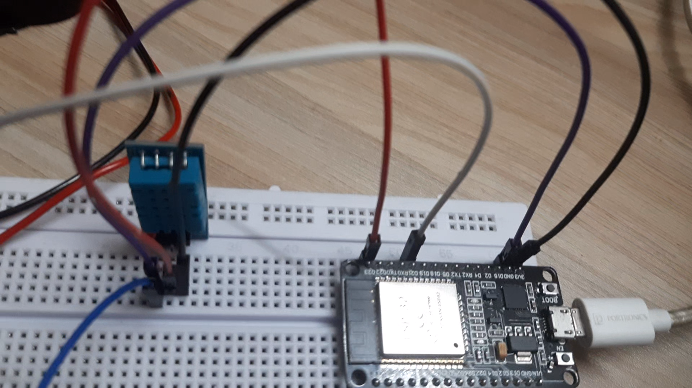
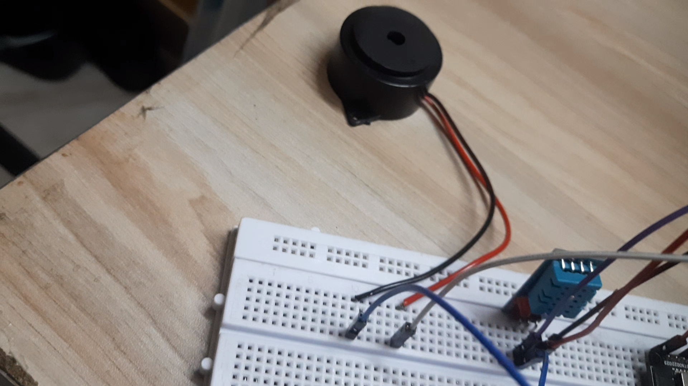
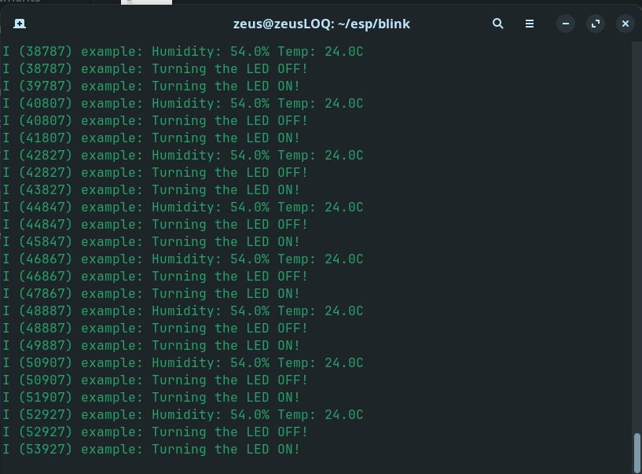

# ESP32 Emulation with QEMU

This document outlines the process of setting up an ESP32 emulation environment using QEMU and demonstrating two applications, as per the OSHW Screening Task.

## 1. System Information

*   **Operating System**: Linux
*   **QEMU Version**: (Please fill in your QEMU version)
*   **ESP-IDF Version**: (Please fill in your ESP-IDF version)

## 2. Setup Steps

This section details the commands used to set up the environment, build, and run the applications.

### a. Environment Setup

It is assumed that you have already cloned the project repository.

1.  **Install ESP-IDF**: Follow the official ESP-IDF Get Started Guide to install the toolchain and dependencies.
    *   [https://docs.espressif.com/projects/esp-idf/en/latest/esp32/get-started/index.html](https://docs.espressif.com/projects/esp-idf/en/latest/esp32/get-started/index.html)

2.  **Set up ESP-IDF environment**: Before running any `idf.py` commands, you must source the `export.sh` script to set up the necessary environment variables.
    ```bash
    . /path/to/your/esp-idf/export.sh
    ```

### b. Build and Run the Temperature Sensor Simulation

1.  **Navigate to the project directory**:
    ```bash
    cd /path/to/your/project
    ```

2.  **Set the target**:
    ```bash
    idf.py set-target esp32
    ```

3.  **Build the application**:
    ```bash
    idf.py build
    ```

4.  **Run the application in QEMU**:
    ```bash
    qemu-system-xtensa -nographic -machine esp32 -drive file=build/blink.elf,if=mtd,format=raw
    ```

### c. Build and Run the Blink and DHT Sensor Application

1.  **Modify `main/CMakeLists.txt`**: To run the blink and DHT sensor application, you need to modify `main/CMakeLists.txt` to include `app_main.c` and exclude `temperature_sensor.c`.
    ```cmake
    idf_component_register(SRCS "app_main.c" "dht_driver.c"
                           INCLUDE_DIRS "."
                           REQUIRES esp_driver_gpio freertos)
    ```

2.  **Build the application**:
    ```bash
    idf.py build
    ```

3.  **Run the application in QEMU**:
    ```bash
    qemu-system-xtensa -nographic -machine esp32 -drive file=build/blink.elf,if=mtd,format=raw
    ```

## 3. Challenges & Fixes

*   **`idf.py` command not found**:
    *   **Challenge**: The `idf.py` command was not found in the shell's path.
    *   **Fix**: This was resolved by sourcing the `export.sh` script from the ESP-IDF installation directory, which correctly sets up the environment variables.

*   **Duplicate `app_main` function**:
    *   **Challenge**: The build failed due to a duplicate `app_main` function definition. Both `temperature_sensor.c` and `app_main.c` (originally `blink_example_main.c`) had this function.
    *   **Fix**: The `main/CMakeLists.txt` file was modified to only include one of the main files at a time, allowing the user to switch between the two applications.

## 4. Demonstration Screenshots

(Please include screenshots of both applications running in QEMU)

### a. Temperature Sensor Simulation

(Screenshot of the temperature sensor output)

### b. Blink and DHT Sensor Application

(Screenshot of the blink and DHT sensor output)

## 5. Reflection

This setup provides a powerful environment for developing and testing ESP32 applications without the need for physical hardware. By using QEMU, we can automate the testing of student code submissions on a platform like Yaksh.

The process would involve:
1.  Receiving the student's code submission.
2.  Compiling the code using `idf.py`.
3.  Running the compiled `.elf` file in QEMU.
4.  Capturing the console output from QEMU.
5.  Comparing the output against a set of expected results to determine the correctness of the submission.

This automated evaluation platform would significantly streamline the process of grading and providing feedback for embedded systems courses.

## 6. Generated Report (report.md)

A `report.md` file has been generated based on the OSHW Screening Task requirements. This report summarizes the setup, challenges, and reflection for the task. Per specific instruction, QEMU-related details (e.g., version information, specific QEMU build steps) were intentionally omitted from this generated report, focusing instead on the broader ESP-IDF setup and conceptual aspects of the emulation task.
